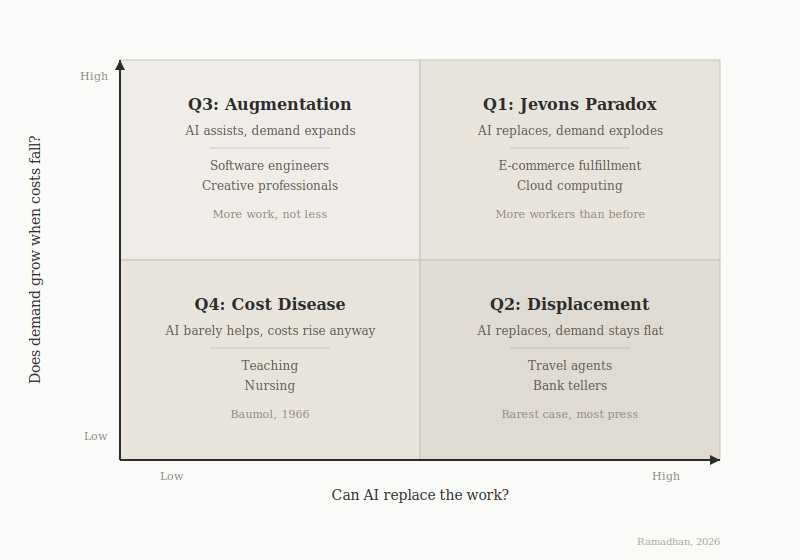

Before my MBA, I worked on automating warehouses and manufacturing floors across Southeast Asia, including autonomous mobile robots, the kind that navigate without tracks, rerouting around obstacles in real time. To clients, efficiency usually means replacing slow parts and cutting costs. What I kept running into was that it never worked quite the way the math said it would. You'd eliminate one bottleneck and a new one would appear somewhere else, almost immediately, as if the system was conserving its own friction.

I came to business school and found a language for it in Operations Management. At IESE, OM starts with something deceptively simple. Every system exists to serve an objective, and the job of management is to organize operations so the system actually reaches it. That framing led directly to the Theory of Constraints, introduced by Eliyahu Goldratt in his 1984 novel The Goal. Every system has a bottleneck, the one step that limits the entire system's throughput. A factory line moves only as fast as its slowest station. A restaurant serves only as many customers as its smallest constraint allows.

The insight that changed how I think about AI came from a throwaway line in a lecture by Mirel Yavuz, my Operations Management professor. The line went: "When you eliminate a bottleneck, you don't eliminate constraints. You just shift the bottleneck to the next weakest link."

I'd seen this on factory floors for years. I started pulling on the OM thread and ended up in a 160-year-old debate about coal mines and concert halls. What I couldn't answer was whether the same thing happens when the automation isn't robots on a warehouse floor but AI running across every knowledge job in the economy, and who ends up on the wrong side when it does.

## 1865 and 1966

William Stanley Jevons was a young economist in 1865 England, trying to answer a question that seemed straightforward: now that Watt's steam engine had become roughly three times more efficient than the Newcomen engine it replaced, would Britain's coal consumption fall? The engineering logic said yes, but Jevons looked at the data and found the opposite.

In Scotland alone, coal consumption for iron production increased tenfold after the cost per ton of iron fell to less than a third of its former amount.[1](#fn-1) Cheaper power opened steam to factories that could never have justified it before, and to railways that built entire economies around it. The efficiency gain revealed a demand that high costs had been suppressing all along.

AI is doing the same thing right now: the cost of running a language model dropped roughly a thousandfold in three years,[2](#fn-2) and every price cut triggered a surge in usage, as if demand had been waiting for the price to fall.

This is what economists call Jevons' Paradox: efficiency doesn't reduce consumption, it expands it. Satya Nadella, CEO of Microsoft, tweeted 'Jevons paradox strikes again' the morning DeepSeek upended the AI market.[3](#fn-3)

In 1966, two economists named William Baumol and William Bowen were trying to understand why opera companies kept running out of money, since almost everything in the postwar economy was getting cheaper, but live performance wasn't. In 1826, you needed four musicians to play a Beethoven string quartet, and on average, it took them thirty minutes. In 2026, you still need four musicians, and it still takes thirty minutes. The productivity is the same because you cannot make Beethoven more efficient without destroying what makes it valuable.

Those musicians in 2026 still need competitive wages in an economy where the average wage is twenty times higher in real terms, pulled up by two hundred years of productivity growth in sectors that actually did get more efficient. Baumol called this Cost Disease. Resistant work gets pulled upward by wages in every sector that did improve. The cost rises without the productivity to justify it.

A doctor's appointment still takes fifteen to twenty minutes. A teacher can still only manage twenty to twenty-five students. These ratios haven't changed in fifty years despite massive investments in technology. Neither Jevons nor Baumol was writing about AI, or about work in the way we talk about it now. Jevons was worried about coal running out. Baumol was worried about orchestras going broke. But the logic they each found turned out to describe something much larger than what they were looking at. Neither of them set out to do that.

I didn't set out to find them either. I was trying to understand why eliminating a bottleneck on a factory floor never felt like the end of the problem.

These two forces operate at the same time, and they're not as separate as they first appear. The productivity boom in one sector is what drives wages up everywhere else. One force triggers the other. Alex Danco, in "Why AC Is Cheap, But AC Repair Is a Luxury" for a16z, put it cleanly: "Jevons is necessary for Baumol's to happen."[4](#fn-4) Most writing on AI sides with Jevons when someone is bullish, or with Baumol when they're not. I kept looking for something the existing writing wasn't offering. Not which force wins overall, but which force applies to any given job.

## How to Sort Every Job in the Economy

I needed something to help me think through this. The sources I found so far gave me two forces but no way to apply them to a specific job or a specific industry. So I ended up drawing a 2x2 matrix. Consulting culture at IESE has a way of seeping into how you think whether you want it to or not, and at some point every problem with two dimensions starts looking like a matrix waiting to be filled in. Last week, sitting in Jeffrey Bussgang's tech ventures class at HBS, it struck me that the obsession goes well beyond IESE. But the two dimensions here actually matter. The first anchor is whether AI can replace humans in this work, or just assist. The second is whether demand grows to absorb the gains. I tried to sort jobs and industries into four boxes, and I haven't found one that doesn't fit somewhere.

In the first box, automation works and demand grows with it. You end up with more workers than you started with. E-commerce and cloud computing both live here, and the pattern is the cheaper the service gets, the more of it people want, until the volume swamps whatever efficiency you gained.

The second box fills every headline about automation. When automation works and demand doesn't grow, the jobs disappear, and the travel agent and bank teller examples are real and documented. What the headlines tend to leave out is that this box is, as far as the data shows, less common than the coverage suggests.

In the third, automation helps but doesn't replace. Better tools unlock harder work rather than less of it. Software engineers have been the clearest example. The box seems to be expanding rather than contracting, though I don't know whether that holds as the models keep improving.

The fourth box is the one I feel most settled about, which is probably a warning sign. When automation barely moves the needle and demand is stable, costs keep rising anyway because wages have to track the rest of the economy. Teaching and nursing sit here. Baumol described this dynamic in 1966 and nothing about the basic shape of it has changed since.

LessWrong, a rationality and technology community known for long-form analytical writing, noted that Jevons and Baumol are 'often defined and discussed in a confused way.' I take that seriously. The matrix is my attempt to be more precise about which force applies where, but I hold it lightly. The quadrants describe tendencies, not settled outcomes.

The matrix is only useful if it predicts something, so here are four cases that test it.

## Four Cases

I can't write about automation without getting to the robots at some point. In 2012, Amazon bought Kiva Systems for $775 million and deployed robots across their fulfillment centers.[5](#fn-5) Each robot could move inventory several times faster than a human worker walking the warehouse. If a robot does the work of three people, the math says you cut your workforce by two thirds. But against the theoretical number, they went from 20,000 warehouse employees in 2012 to over 750,000 in 2024.[6](#fn-6) Thirty-seven times more people, after automating. Amazon's revenue grew roughly twenty times over the same period. Employment grew thirty-seven times, faster than the business itself. The robots didn't replace workers; they made the business big enough to need far more of them.

The robots made fulfillment fast enough for same-day delivery, which unlocked demand that had always been there. Order volume multiplied. Even though each order required less labor, volume dominated efficiency.

The bottleneck didn't disappear. It shifted. First it was warehouse picking. Then packing and sorting. Then last-mile delivery. Last-mile delivery has no automation solution at scale. That became the new constraint. Amazon is still hiring because they keep hitting new bottlenecks as they push volume higher.

Not every case looks like Amazon. In Quadrant Two, automation is just as easy, but demand doesn't fill the space. In 2000, there were 124,000 travel agents in the US. By 2024, 65,700, down roughly 47%.[7](#fn-7) Expedia and Booking.com replaced the agent entirely.

Demand for travel kept growing, but demand for the person who booked it didn't. Expedia made booking frictionless, but frictionless booking doesn't make people travel more. It just removes the intermediary. The market expanded; the agent's share of it went to zero.

The work could be automated, demand was fixed, and workers lost jobs. That outcome is what most people picture when they think about automation displacing workers. It's actually the rarest of the four cases, and the most overrepresented.

Quadrant Three is where things get counterintuitive again. When GitHub Copilot launched in 2022, it made coding measurably 55% faster.[8](#fn-8) Software developer employment grew by roughly 13% from 2022 to 2024, reaching 1.7 million jobs.[9](#fn-9) Before AI tools, engineering capacity was the bottleneck on product development. Product teams had backlogs of features they wanted to build but couldn't justify staffing for. AI relaxed that constraint and revealed the true appetite for product. The bottleneck moved from execution to judgment, and AI can't follow it there yet.

Teaching sits in Quadrant Four, and it's the most instructive case. The teacher-to-student ratio was about 18:1 in 1980. In 2024, it sits at around 16:1, barely moved after decades of investment in whiteboards, tablets, learning management software, and AI tutoring tools.[10](#fn-10) Two fewer students per teacher across forty years. That is the productivity gain technology delivered to education.

Indonesia is the cleanest case study. The government doubled base teacher pay between 2006 and 2015, moving certified teachers from the 50th to the 90th percentile of wages for college graduates. A World Bank study found no measurable effect on student test scores or teacher knowledge.[11](#fn-11) The salary increase was real. The productivity gain was zero.

As AI automates work in the first three quadrants, more economic activity shifts into the fourth. Healthcare and education keep growing as shares of employment precisely because they resist that pressure.

## Where It Lands

The promise of AI is leisure. It is the same promise made after electrification, after the internet, after email. Zero for three, and someone is always there to explain why this time is different. The bottleneck always moves.

A friend from the MBA program, Thomas Reeves, pointed me to a concept traffic engineers have known about for decades called induced demand. When you build more highway lanes, you attract more cars until the roads are as full as before. The supply creates its own demand.

AI makes you five to ten times more productive in the quadrants where automation works and demand grows. You can do in one hour what used to take ten. Except now your boss expects you to do ten times more work. Your capacity increased, and so did the expectations, until you're doing ten times more things.

The bottleneck shifts from "I don't have time to do this" to something harder to name. The next frontier of work, in my view, is everything that doesn't scale at the speed AI does.

Inside organizations, the same logic applies at a different altitude. Rule-based work is the first to go. Software development and financial reporting are good examples. Both are high-skill, high-pay, but ultimately rule-bound. AI doesn't need to be perfect to displace them. It needs to be fast enough and cheap enough, and it already is. The constraint moves to what can't be specified in advance.

Culture sits in the fourth box by a different route. The tools aren't weak and demand isn't stable. The output just can't be measured. Keeping a company's culture alive means reading a room and making calls that feel wrong on a spreadsheet but right in context. The accountability can't be reduced to a sequence a model can learn. That, I think, is what survives.

John Maynard Keynes, the British economist whose ideas reshaped how governments think about growth and employment, predicted in a 1930 essay called Economic Possibilities for Our Grandchildren that we'd have a fifteen-hour workweek by now. He was wrong not because the productivity didn't materialize, but because he assumed the gains would translate into leisure rather than higher expectations and new bottlenecks. The constraint doesn't just shift between tasks as the work expands. It shifts between people. I built a business in Southeast Asia on the assumption that proximity to the problem was an advantage. I'm less certain of that now.

## Standing Next to the New Bottleneck

The developers I worked with in Jakarta built careers on doing skilled work at a fraction of Western rates. That was the entire value proposition. The $15/hour virtual assistant competing against a $60/hour American had a clear edge. Now they are both competing with a $0.003/API-call language model. The same math applies to the financial analyst in Lagos, the legal researcher in São Paulo, anyone whose edge was cost in a world where cost is about to stop mattering.

Nobody cared about a patchy connection when the deliverable showed up in a day at a fifth of the price. That changes when the competition shifts to AI-augmented output speed, when the developer in San Francisco ships in one hour what used to take a team in Malang, an Indonesian city with a deep bench of remote developers doing outsourced work, a full week. A third of the world is still offline, and AI investment follows capital flows. The bottleneck moved, and a constraint that was always there became the binding one.

Goldratt's point in The Goal was that you should choose your bottleneck deliberately, which is to have a constraint you can see and manage. Societies don't get that option, and nobody is the plant manager. Nobody has the power to control the bottleneck. Well, at least in theory, because those who have power over capital and computing might be able to. The constraint moves, and we figure it out after.

The question worth sitting with is not "will AI create jobs or destroy them"; the answer is probably both, in different quadrants, unevenly distributed. The better question is who captures the new bottleneck when the constraint moves, and who gets left holding the one that got optimized away.

The framework holds job by job. The harder question is what happens when Q2 outcomes land simultaneously across an entire white-collar economy, when the constraint doesn't shift to a new job type but to a depleted consumer base. That's the scenario the matrix can't sort, and the one worth keeping in mind.

The productivity gains from AI will not be evenly distributed, and nobody serious expects them to be. Private equity firms, platform owners, the people who already hold the capital that runs the infrastructure will capture the gains. The rest of us capture the workload. Leisure has always been the name we give to a future that moves as fast as you walk toward it. Agents will work with what looks like agency. And there will always be something on your plate, because the system was never designed to empty it.

I started this thinking about factory floors in Southeast Asia, watching robots take over one station and a queue form at the next. The honest question I keep coming back to is whether I'm preparing for the right shift, or just the one I can see from where I'm standing. Jevons and Baumol don't give you the answer. But they force you to ask the question before the bottleneck moves.

The constraint moves. Who's standing next to it when it does?

---

[1] Jevons, W.S. (1865). *The Coal Question: An Inquiry Concerning the Progress of the Nation, and the Probable Exhaustion of Our Coal Mines.* London: Macmillan. Chapter VII, "Of the Economy of Fuel." The tenfold figure comes from Jevons's own data on Scottish iron production. Total UK coal consumption roughly tripled over the same period, which is still paradoxical, but the iron case is the sharpest illustration.

[2] Gupta, A., Raghunathan, A., and Boneh, D. (2024). "Welcome to LLMflation: LLM Inference Cost Is Going Down Fast." Andreessen Horowitz (a16z). [https://a16z.com/llmflation-llm-inference-cost/](https://a16z.com/llmflation-llm-inference-cost/). The headline number is 10x cost reduction per year at equivalent performance. The thousandfold figure holds for GPT-3-level tasks over three years. At the frontier, costs drop slower. The trend is real but uneven.

[3] Nadella, S. (@satyanadella). "Jevons paradox strikes again! As AI gets more efficient and accessible, we will see its use skyrocket, turning it into a commodity we just can't get enough of." X (formerly Twitter), January 27, 2025. [https://x.com/satyanadella/status/1883753899255046301](https://x.com/satyanadella/status/1883753899255046301). A tech CEO reaching for a 160-year-old coal economics concept rather than a business school framework or a Silicon Valley buzzword says something about how far this conversation has traveled. The tweet came the morning DeepSeek's R1 model triggered a selloff in US tech stocks.

[4] Danco, A. (2021). "Why AC Is Cheap, But AC Repair Is a Luxury." Andreessen Horowitz (a16z). [https://a16z.com/why-ac-is-cheap-but-ac-repair-is-a-luxury/](https://a16z.com/why-ac-is-cheap-but-ac-repair-is-a-luxury/). Danco's piece is the clearest short explanation I found of why Jevons and Baumol are not opposing forces but sequential ones. The air conditioning framing makes the mechanism concrete.

[5] Amazon.com Inc. (2012). "Amazon.com to Acquire Kiva Systems, Inc." SEC Filing, March 19, 2012. Acquisition price: $775 million in cash. At the time, this was Amazon's second-largest acquisition. The robots were originally sold to competitors including Staples and Gap. Amazon stopped selling them externally after the deal closed.

[6] Amazon corporate filings and MacroTrends (AMZN employee data). Amazon's total workforce reached 1,556,000 in 2024; approximately 65% work in operations and fulfillment roles (Red Stag Fulfillment, citing Amazon data). The 20,000 figure is the commonly cited estimate for fulfillment-specific headcount in 2012. Amazon's total workforce was 88,400 that year. By 2024, roughly half of Amazon's employees work in operations and fulfillment.

[7] U.S. Bureau of Labor Statistics. "Occupational Outlook Handbook: Travel Agents." 65,700 jobs held in 2024. [https://www.bls.gov/ooh/sales/travel-agents.htm](https://www.bls.gov/ooh/sales/travel-agents.htm). The peak was around 124,000 in the early 2000s. The decline is steeper than it looks because part-time and independent agents partially mask the drop in full-time positions.

[8] Peng, S., Kalliamvakou, E., Cihon, P., and Demirer, M. (2023). "The Impact of AI on Developer Productivity: Evidence from GitHub Copilot." arXiv:2302.06590. The 55.8% figure comes from a controlled experiment with 95 developers building an HTTP server in JavaScript. The confidence interval is wide (21–89%), and the task was relatively standardized. Real-world productivity gains are likely smaller but directionally consistent.

[9] U.S. Bureau of Labor Statistics. "Occupational Outlook Handbook: Software Developers, Quality Assurance Analysts, and Testers." [https://www.bls.gov/ooh/computer-and-information-technology/software-developers.htm](https://www.bls.gov/ooh/computer-and-information-technology/software-developers.htm). BLS groups software developers, QA analysts, and testers together. The 1.7 million figure is developers specifically. The broader category is about 1.9 million.

[10] National Center for Education Statistics. "Digest of Education Statistics: Table 208.20." [https://nces.ed.gov/programs/digest/d16/tables/dt16_208.20.asp](https://nces.ed.gov/programs/digest/d16/tables/dt16_208.20.asp). The ratio was 18.7 in 1980 and hovered around 16.0 through the 2010s. Most of the improvement happened in the 1980s and 1990s, driven partly by special education mandates under IDEA (1975), not by technology.

[11] de Ree, J., Muralidharan, K., Pradhan, M., and Rogers, H. (2018). "Double for Nothing? Experimental Evidence on an Unconditional Teacher Salary Increase in Indonesia." *Quarterly Journal of Economics*, 133(2), 993–1039. This is one of the largest randomized controlled trials in education economics. 360 schools, 20 districts, across a representative sample of Indonesia. The null result on learning outcomes is precisely estimated, not just a failure to detect.
